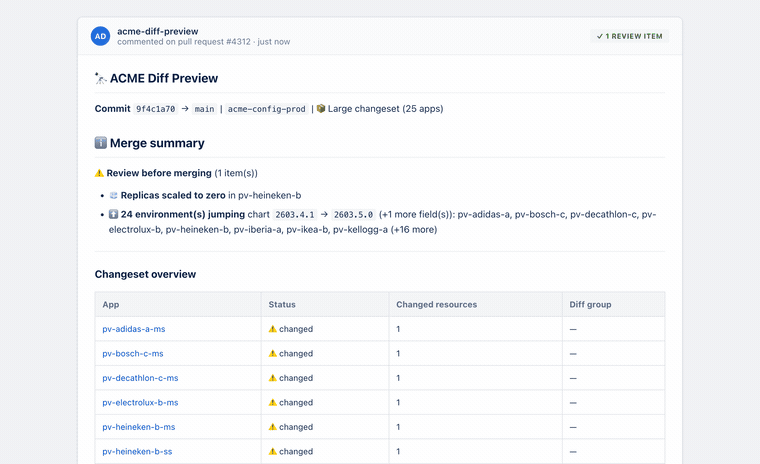
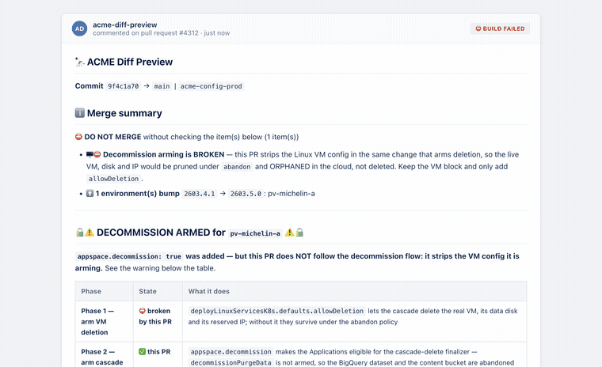

<h1 align="center">🔭 acme-diff-preview</h1>

<h3 align="center">See exactly what ArgoCD is about to change — before you merge.</h3>

<p align="center">
Open a pull request on a config repo. Get back every Kubernetes resource that
will change, per environment, as a real diff —<br>plus one verdict line telling
you whether it is safe.
</p>

<p align="center">
<a href="https://github.com/appspace-cloud/acme-diff-preview/actions/workflows/ci.yml"></a>
<a href="https://github.com/appspace-cloud/acme-diff-preview/actions"></a>
<a href="https://github.com/appspace-cloud/acme-diff-preview/releases"></a>

</p>

<p align="center">

</p>

<p align="center">
<sub><i>A real monthly bump. 25 apps, 24 folded into a single line —<br>
and the one that isn't like the others, named at the top.</i></sub>
</p>

---

## The problem it solves

A monthly customer bump touches **hundreds of environments**. Reviewing that by
reading YAML is not review, it is scrolling. So the interesting change — the
replica count that went to zero, the disk that shrank, the environment quietly
armed for deletion — rides along unnoticed.

This service renders both sides with `helm template`, diffs them resource by
resource, and answers the only question that matters at merge time:

> **Is there anything in here I would regret?**

## What makes it different

|  | acme-diff-preview | Plain ArgoCD | Atlantis-style plan bots |
|---|---|---|---|
| **Answers before merge** | ✅ diff of the PR against `main` | ❌ shows drift *after* sync | ✅ but Terraform only |
| **One verdict, not a wall** | ✅ ⛔ / ⚠️ / ✅ with named findings | ❌ | ❌ raw plan output |
| **Knows what is dangerous** | ✅ **22 distinct findings**: deletions, decommissions, data purges, disk shrink, zeroed replicas, downgrades, orphaned VMs, renames… | ❌ | ❌ |
| **Scales to a fleet** | ✅ 863 apps in one PR; identical diffs folded once | ❌ | ❌ per-workspace |
| **Never says "no changes" on failure** | ✅ a failed render is red, never green | ❌ | ⚠️ varies |
| **Reads secrets safely** | ✅ redacted before it ever reaches a comment | n/a | n/a |
| **Needs an agent on the cluster** | ❌ renders locally | ✅ | ✅ |

## It refuses to be wrong quietly

The one rule the tool never breaks: **a failure is never reported as
"no changes."** If a diff could not be computed, the status says so and the PR
is not marked clean.

That principle is enforced, not aspirational — the merge gate goes red when the
change would break something irreversible:

<p align="center">

</p>

<p align="center">
<sub><i>This PR arms a deletion and strips the VM config it acts through.<br>
The VM would be orphaned in the cloud, not deleted. Blocked.</i></sub>
</p>

## How it works

```
PR opened on acme-config-*
        │
        ├─ which ArgoCD apps does this PR touch?      (inventory, refreshed every 5 min)
        ├─ render each app at main         ──┐
        ├─ render each app at the PR sha   ──┴─ diff, resource by resource
        │
        └─ one comment  +  one build status (green / blocked)
```

**It renders locally.** `helm template` for both sides, diffed in Python.
ArgoCD is used only to discover which apps exist — never to perform the diff,
and no spoke agent is contacted.

**It compares desired against desired** — the PR against `main`, not against
live state. Accurate here because every ApplicationSet runs `selfHeal: true`
(measured 2026-07-31: 1020 of 1021 apps Synced).

## Quick start

```bash
helm repo add acme-diff-preview https://appspace-cloud.github.io/acme-diff-preview
helm install acme-diff-preview acme-diff-preview/acme-diff-preview \
  --namespace argocd \
  --set diff.repos="acme-config-dev;acme-config-prod"
```

Full configuration, every env var, and the guard-by-guard breakdown live in
**[docs/reference.md](docs/reference.md)**.

## Documentation

| | |
|---|---|
| [Reference](docs/reference.md) | Every knob, endpoint, guard and layout detail |
| [Internals](docs/internals.md) | How the render, cache and comment budget work |
| [Releasing](RELEASING.md) | Release flow, rollback, and the traps that bite |
| [Testing](TESTING.md) | 1964 tests, 22 goldens, and the seam audit |
